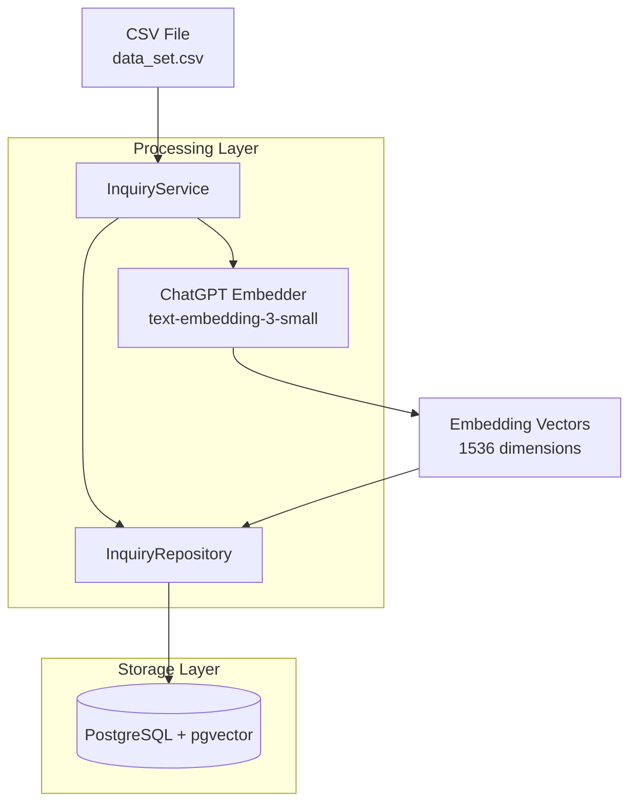
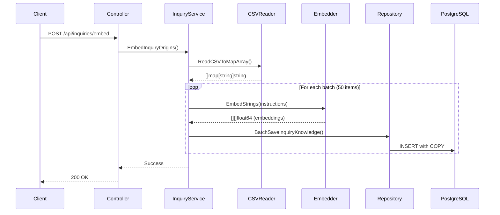

# CSV 데이터 임베딩 및 PostgreSQL 저장

## 아키텍처 개요

## 데이터베이스 테이블 구조

**inquiry_knowledge_base** 테이블:

- `id`: SERIAL PRIMARY KEY
- `instruction`: TEXT (원본 질문 텍스트)
- `instruction_embedding`: VECTOR(1536) (임베딩 벡터)
- `response`: TEXT (응답 템플릿)
- `category`: VARCHAR(100) (카테고리, 예: ORDER)
- `intent`: VARCHAR(100) (의도, 예: cancel_order)
- `flags`: VARCHAR(50) (플래그)
- `created_at`: TIMESTAMP
- `updated_at`: TIMESTAMP

**검색 최적화:**

- HNSW 인덱스 (벡터 유사도 검색용)

## 구현 단계

### 1. PostgreSQL pgvector 설정

**파일:** [`docker-compose.yml`](docker-compose.yml)

- postgres 이미지를 `pgvector/pgvector:pg16`으로 변경
- 벡터 검색 기능 활성화

### 2. 마이그레이션 파일 재설정

**기존 마이그레이션 파일 삭제:**

- `migrations/000001_create_users_table.up.sql` 삭제
- `migrations/000001_create_users_table.down.sql` 삭제

**파일:** `migrations/000001_create_inquiry_knowledge_base.up.sql` (신규)

- pgvector extension 설치
- inquiry_knowledge_base 테이블 생성
- HNSW 인덱스 생성 (벡터 검색 최적화)

**파일:** `migrations/000001_create_inquiry_knowledge_base.down.sql` (신규)

- 롤백 스크립트

### 3. Domain 모델 정의

**파일:** `internal/domain/inquiry_knowledge.go`

- InquiryKnowledge 구조체 정의
- CSV 필드와 매핑

### 4. Repository 인터페이스 확장

**파일:** [`internal/repository/repository.go`](internal/repository/repository.go)

- `InquiryRepository`에 저장 메서드 추가:
  - `BatchSaveInquiryKnowledge(ctx, items []*domain.InquiryKnowledge) error`

### 5. PostgreSQL Repository 구현

**파일:** `internal/repository/postgres/inquiry_repo.go` (신규)

- pgx 드라이버를 사용한 벡터 저장 구현
- 배치 insert 최적화 (성능 향상)

### 6. UseCase 로직 구현

**파일:** [`internal/usecase/inquiry.go`](internal/usecase/inquiry.go)

- CSV 읽기 (기존 코드 활용)
- instruction 필드 추출 및 배치 임베딩
- PostgreSQL에 저장

### 7. 의존성 주입

**파일:** [`cmd/server/main.go`](cmd/server/main.go)

- ChatGPT Embedder 초기화 (OPENAI_API_KEY 환경변수 필요)
- InquiryRepository 초기화 (PostgreSQL + Embedder)
- InquiryService에 주입

**파일:** [`internal/config/config.go`](internal/config/config.go)

- `OpenAIAPIKey` 필드 추가

### 8. 컨트롤러 활성화

**파일:** [`internal/handler/http/inquiry_controller.go`](internal/handler/http/inquiry_controller.go)

- 이미 존재하는 EmbedInquiryOrigins 엔드포인트 활용
- POST 요청으로 임베딩 프로세스 트리거

## 실행 흐름

## 실행 방법

1. Docker 컨테이너 재시작 (pgvector 이미지 적용)
2. 마이그레이션 실행: `make migrate-up`
3. 환경변수 설정: `OPENAI_API_KEY=sk-...`
4. 서버 실행: `make run`
5. 임베딩 실행: `curl -X POST http://localhost:8080/api/inquiries/embed`

## 주요 고려사항

- **배치 처리:** CSV 데이터(388개)를 50개씩 묶어서 임베딩 (API 호출 최소화)
- **에러 처리:** 일부 실패 시에도 처리된 데이터는 저장 (부분 성공 지원)
- **중복 방지:** instruction을 UNIQUE 제약조건으로 설정 (ON CONFLICT DO UPDATE)
- **성능:** COPY 프로토콜 사용으로 대량 insert 최적화