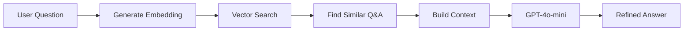

# Simple Chatbot - AI-Powered Inquiry System

An intelligent inquiry chatbot built with Go, implementing RAG (Retrieval Augmented Generation) architecture with vector similarity search and AI-powered answer refinement using OpenAI GPT-4o-mini.

## ✨ Features

- **RAG (Retrieval Augmented Generation)** architecture for context-aware responses
- **Vector Similarity Search** using PostgreSQL with pgvector extension
- **AI-Powered Answer Refinement** with OpenAI GPT-4o-mini
- **Semantic Embeddings** using OpenAI text-embedding-3-small (1536 dimensions)
- **LLM Orchestration** with Cloudwego Eino framework
- **CSV Knowledge Base Ingestion** for easy data import
- **Clean Architecture** with clear layer separation (Domain, Repository, UseCase, Handler)
- **Custom Error Handling** system with 4-digit error codes
- **Structured Logging** with TrID (Transaction ID) tracking using Zerolog
- **EntGo ORM** with PostgreSQL for type-safe database operations
- **Database Migrations** with go-migrate for version-controlled schema changes
- **Docker Compose** for local development infrastructure

## 🛠 Tech Stack

### Core Technologies
- **Go** 1.24+
- **Chi Router** - Lightweight, idiomatic HTTP router
- **PostgreSQL** with **pgvector** - Vector database for similarity search
- **EntGo** - Type-safe ORM with code generation
- **Zerolog** - Structured JSON logging
- **go-migrate** - Database migration tool
- **Docker Compose** - Local infrastructure management

### AI & LLM Stack
- **Cloudwego Eino** - LLM orchestration framework
- **OpenAI API**
  - GPT-4o-mini - Answer refinement and generation
  - text-embedding-3-small - Vector embeddings (1536 dimensions)
- **pgvector** - PostgreSQL extension for vector operations with HNSW indexing

## 📋 Prerequisites

- Go 1.24 or higher
- Docker and Docker Compose
- OpenAI API Key
- Make (optional, for convenience commands)

## 🚀 Quick Start

### Setup

1. **Clone and install dependencies**
   ```bash
   git clone <repository-url>
   cd simple-chatbot
   go mod download
   ```

2. **Configure environment**
   ```bash
   cp .env.local.example .env.local
   # Edit .env.local and add your OPENAI_API_KEY
   ```

3. **Start database and run migrations**
   ```bash
   make infra-up
   make migrate-up
   ```

4. **Run the server**
   ```bash
   make build && ./bin/server
   # or: go run cmd/server/main.go
   ```

### API Usage

**1. Health Check**
```bash
curl http://localhost:8080/healthz
```

**2. Load Knowledge Base** (from `mock_data/data_set.csv`)
```bash
curl -X POST http://localhost:8080/inquiry/embed/origins
```

**3. Ask Questions**
```bash
curl -X POST http://localhost:8080/inquiry/ask \
  -H "Content-Type: application/json" \
  -d '{"msg": "How do I reset my password?"}'
```

Response:
```json
{
  "trid": "...",
  "code": "0200",
  "result": {
    "answer": "To reset your password, click on 'Forgot Password'..."
  }
}
```

## 📁 Project Structure

```
├── cmd/
│   ├── server/              # HTTP server
│   └── migrate/             # Migration runner
├── internal/
│   ├── config/              # Configuration
│   ├── database/            # LLM & DB initialization
│   ├── domain/              # Business entities
│   ├── handler/http/        # Controllers & middleware
│   ├── repository/
│   │   ├── langchain/       # LLM repositories
│   │   └── postgres/        # PostgreSQL + vector search
│   ├── usecase/             # Business logic
│   └── shared/              # Utilities
├── pkg/                     # Reusable packages
├── mock_data/               # Sample CSV data
└── docker-compose.yml       # PostgreSQL with pgvector
```

## ⚙️ Configuration

Environment variables (all required):

| Variable         | Description                    | Example                    |
| ---------------- | ------------------------------ | -------------------------- |
| `PORT`           | Server port                    | `8080`                     |
| `ENV`            | Environment (local, dev, prod) | `local`                    |
| `DB_HOST`        | PostgreSQL host                | `localhost`                |
| `DB_PORT`        | PostgreSQL port                | `5432`                     |
| `DB_USER`        | Database user                  | `postgres`                 |
| `DB_PASSWORD`    | Database password              | `postgres`                 |
| `DB_NAME`        | Database name                  | `go_boilerplate`           |
| `DB_SSLMODE`     | SSL mode                       | `disable`                  |
| `OPENAI_API_KEY` | OpenAI API key for GPT & embeddings | `sk-...`              |

## 📡 API Endpoints

| Method | Path                      | Description                 |
| ------ | ------------------------- | --------------------------- |
| `GET`  | `/healthz`                | Health check                |
| `POST` | `/inquiry/ask`            | Ask question, get AI answer |
| `POST` | `/inquiry/embed/origins`  | Load CSV knowledge base     |

**Request Format** (`/inquiry/ask`):
```json
{"msg": "Your question"}
```

**Response Format**:
```json
{
  "trid": "...",
  "code": "0200",
  "result": {"answer": "..."}
}
```

## 🏗 How It Works

### RAG Pipeline Overview



**The system works in 4 simple steps:**

1. **Generate Embedding**: Convert user question to vector using OpenAI embeddings
2. **Vector Search**: Find top 3 similar questions from database using cosine similarity
3. **Build Context**: Format similar Q&A pairs as context for the LLM
4. **Refine Answer**: GPT-4o-mini generates a refined answer based on the context

### Key Features

**Embedding Generation**
- Uses OpenAI `text-embedding-3-small` (1536 dimensions)
- Batch processing for efficiency (50 items per batch)

**Vector Search**
- PostgreSQL with pgvector extension
- HNSW indexing for fast similarity search
- Cosine distance calculation

**Answer Refinement**
- GPT-4o-mini generates contextually relevant answers
- JSON response format for reliability

## 🔧 Development

**Database**
```bash
make infra-up          # Start PostgreSQL
make migrate-up        # Run migrations
make ent-generate      # Generate EntGo code
```

**Build & Run**
```bash
make build             # Build binary
make start             # Run binary
go run cmd/server/main.go  # Development mode
```

**Code Quality**
```bash
make test              # Run tests
make lint              # Lint code
make fmt               # Format code
```

**All Commands**
See `make help` or check the Makefile for complete list.

## 💡 Key Concepts

- **Vector Embeddings**: Text → numerical vectors that capture semantic meaning
- **RAG**: Retrieval + AI generation for accurate, context-aware answers
- **pgvector**: PostgreSQL extension for vector similarity search
- **HNSW Index**: Fast approximate nearest neighbor search

## 🎯 Use Cases

- Customer support chatbot with natural language Q&A
- Technical documentation assistant
- FAQ system with semantic search

## 🔨 Available Commands

| Command                | Description                    |
| ---------------------- | ------------------------------ |
| `make infra-up`        | Start PostgreSQL               |
| `make migrate-up`      | Run migrations                 |
| `make ent-generate`    | Generate EntGo code            |
| `make build`           | Build application              |
| `make start`           | Run binary                     |
| `make test`            | Run tests                      |
| `make lint`            | Lint code                      |
| `make fmt`             | Format code                    |

## 🤝 Contributing

1. Run `make test-all` before committing
2. Follow conventions in `.cursor/rules/convention.mdc`
3. Keep functions focused and documented

---

**Built with Go, RAG, and OpenAI**
